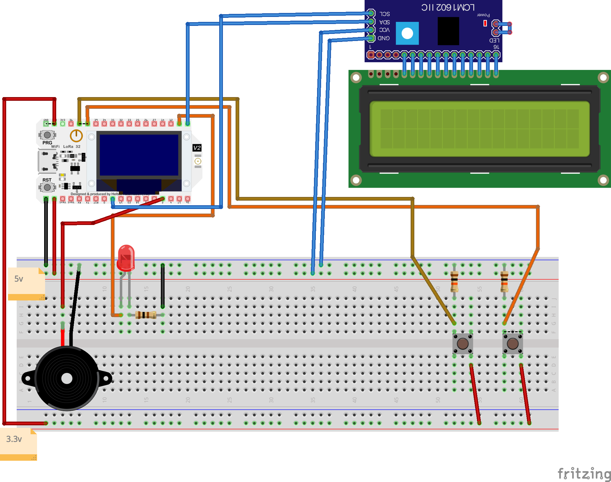

# Tutorial on how to build an IoT-Intercom
## Short Overview
This IoT device makes it possible to receive a message sent from a mobile phone or other network device and then reply with button clicks. Following project is the result of an IoT course at LNU Sweden. My name is Alexander Ström (as227nn) and following is a tutorial on how to build your own!

## What is this? And how does it work?
This device receives a message sent by a Node-RED dashboard, Node-RED is a flow based programming environment which handles all the traffic from and to the device as well as the cloud solution chosen in this project. When a message is sent, it will be shown on the IoT-Intercom as well as an LED light and buzzer sound. The person who has the device will be able to choose an answer that will be sent back to Node-RED. Node-RED will only store the current question, answer and time to answer while Ubidots will be used to store all messages, also giving an average value of answer time. This tutorial will explain how to set up all this.


</br>_Figure showing the communication architecture/network functionalities_


**How much time it might take to do (approximation):**

Considering everything working as expected without any unmentioned problems with solutions this project might take 2 days, or approximation 15-20 hours to complete.

## Origin
### Project idea and purpose:
This project idea started from an earlier software solution called "Matroparen" (Enligsh: Food announcements), that acted as a way to tell everybody at home that the food was to be served. This was pretty simple and built upon webhooks messaging devices. But now it wanted something more complex and connected to the IoT spectrum with some hardware and circuitry involved. The way this device is built also makes it possible to collect data such of how long it takes for the person to answer the question.

### Insights
Completing this project will give a brief understanding of the IoT world as well as some basic circuitry, cloud solutions and programming (mainly python). You will also get a brief understanding on some communication protocols and solutions used in it for example: MQTT and HTTP Requests

# Materials
To bee able to follow this tutorial please gather microcontroller, sensors etc with same specifications as described bellow. I've already gathered all those components from different kits at different times, but you can buy them from the links below:

| Component            | Purpose & Description                                                                                                                                                                                                                                     | Can be bought at (Sweden):                                                                                                                                                                                                                                                                                                               | Price (approximately) |
|----------------------|-------------------------------------------------------------------------------------------------------------------------------------------------------------------------------------------------------------------------------------------------|------------------------------------------------------------------------------------------------------------------------------------------------------------------------------------------------------------------------------------------------------------------------------------------------------------------------------------------|-----------------------|
| Heltec LoRa v2/ESP32  | Heltec LoRa v2 has been used in this<br>project, but no LoRa is used so almost <br>any ESP32 based device will work as well.  The chosen Heltec development board is based on ESP32 which is a low-cost and low-powered system on a chip with integrated WiFi and Bluetooth possibilities, and the Heltec one also comes with LoRa. Development board makes it easy to connect to components with their pins located on the sides.                                                                                                                     | [amazon.se](https://www.amazon.se/gp/product/B078M74NNN/ref=ppx_yo_dt_b_asin_title_o00_s00?ie=UTF8&psc=1)                                                                                                                                                                                                                                             | 300kr                 |
| 2 PCB Buttons         | These buttons will be used to make the user<br>choose answer by opening a voltage circuit and trigger input pin                                                                                                                                                                                    | [electrokit.com](https://www.electrokit.com/produkt/knappar-pcb-sortiment-12st/)                                                                                                                                                                                                                                                                           | 80kr (12pcs)          |
| Bread Board           | This is used to connect all components solderless, but <br>you can design and print your own PCB if enough knowledge                                                                                                                                        | [sizable.se](https://sizable.se/P.TVY7M/Kopplingsdack-med-830-punkter)                                                                                                                                                                                                                                                                                 | 53kr                  |
| Jumper Wires          | Only if bread board: These wires is used<br>to connect all components. Three different<br>contacts used as in link: female-to-female, male-to-female male-to-male!                                                                                                                              | [amazon.se](https://www.amazon.se/Elegoo-Flerf%C3%A4rgad-Breadboard-Bandkablar-Arduino/dp/B01EV70C78/ref=asc_df_B01EV70C78/?tag=shpngadsglede-21&linkCode=df0&hvadid=476462430370&hvpos=&hvnetw=g&hvrand=7042316417688917121&hvpone=&hvptwo=&hvqmt=&hvdev=c&hvdvcmdl=&hvlocint=&hvlocphy=1012345&hvtargid=pla-362913641420&psc=1)                                                                                                                                                                                                                                                                                                     | 80kr                  |
| Resistors (2: 10k, 1:100)             | The resistor acts as a electrical resistance and reduces current, correct signal levels etc. In this project only two 10K Ohm is used as <br>pull-down resistor and one 100 Ohm for the LED.<br>But a pack of resistors is always good to have.                                                                                              | [sizable.se](https://sizable.se/P.3MSQ6/30-Varden-Motstand-600-st)                                                                                                                                                                                                                                                                                     | 72kr                    |
| Red LED               | This is used to warn user that a message has arrived.<br>The projects uses a red LED that emits red light (red defuse) but any color and diameter<br>can be used (consider that you need different resistors for<br>different LEDs, this project uses 5mm RED 2v forward voltage) | [electrokit.com](https://www.electrokit.com/produkt/led-5mm-rod-diffus-1500mcd/)                                                                                                                                                                                                                                                                           | 5kr                      |
| LCD 16x2              | This is the main component that displays the message. You<br>can use any size you want but in this project 16x2 is used.<br> An LCD consists of liquid-crystal that can turn on and off to display text or other pictures. Consider one with I2C (synchronous serial communication), that makes it easier and requires less<br>wireing. If you are using a Heltec v2 board as in the tutorial you can use the built in OLED screen instead of a separate LCD.                                          | [amazon.se](https://www.amazon.se/AZDelivery-LCD-Modulvisningsbunt-I2C-Gr%C3%A4nssnitt-kompatibel-Raspberry/dp/B07CQG6CMT/ref=asc_df_B07CQG6CMT/?tag=shpngadsglede-21&linkCode=df0&hvadid=476555136704&hvpos=&hvnetw=g&hvrand=582242616344342109&hvpone=&hvptwo=&hvqmt=&hvdev=c&hvdvcmdl=&hvlocint=&hvlocphy=1012345&hvtargid=pla-653596068129&psc=1) | 89kr                      |
| Buzzer                | This buzzer makes a sound (with frequency) when receiving a message and also when<br>sent successfully. This outputs a lower db sound than a speaker, <br>so if correct knowledge speaker is recommended.                                                        | [conrad.com](https://www.conrad.se/p/conrad-components-93038c212a-miniatyr-summer-ljudniva-85-db-spaenning-5-v-1-st-1511467?utm_campaign=shopping-feed&utm_content=free-google-shopping-clicks&utm_medium=surfaces&utm_source=google&utm_term=1511467&vat=true)                                                                                        | 8kr                      |

**Total: 700kr**

## Computer setup
To be able to program the device an IDE is needed, which is a coding environment that handles all needed processes. For this tutorial Atom is used, therefore the first step is to download and setup Atom here: https://atom.io/.

Before we can program the device we need to flash it with its correct firmware, so connect the device with a micro USB cable to your computer. And if your on Windows you will need to install the driver first [here](https://www.silabs.com/documents/public/software/CP210x_Windows_Drivers.zip) One way of doing this is to visit the website: https://nabucasa.github.io/esp-web-flasher/. In the top right corner is a connect button, but before pressing this you will need to set the baud which is 460800 for both the Heltec and a generic ESP32. After clicking connect you choose the serial port from the popup. The terminal will let you know if connect, if so please erase the device. Then you choose to upload file in the first offset, [here is the file for Heltec](https://github.com/H-Ryan/Heltec/blob/main/PyCom%20MicroPython/Heltec%20PyCom%20MicroPython.zip?raw=true) and [here is the file for ESP32](https://micropython.org/resources/firmware/esp32-20220117-v1.18.bin). When all done and successfully flashed we can continue on in Atom.


</br>_Figure 3.1 image that choose ESP Web Flasher website with baud and connect_


</br>_Figure 3.1 image that choose ESP Web Flasher website with erase and upload_

Before connecting to the device its recommended to turn off Safe-Boot in Atom global settings. After this you will be able to connect to the device from the
COM3 interface on Windows. On mac you will need to find the device adress, this can be done with terminal command: ```ls /dev/```, it should look something like ```/dev/tty.usbserial-0001```. Set this under the device adress (list) option in Atom global settings. Now you should bee able to successfully connect to the serial communication in Atoms terminal (click Connect Device).

## Circuit Diagram - Putting everything together
When Atom is up and running and your successfully able to communicate with the development board its time to make all the circuitry. For this tutorial a bread board is used as described earlier.
You should end up with a bread board looking something like this below:
</br>

For those of you that want to use something else or design a PCB here is the schematic:
</br>

Referring to the bread board image you can connect the component in which order you want. But I would recommend connecting LED first, and even connecting a battery source to understand how LED, current, and resistors are working. If you are using another LED and do not feel confident about reading resistor cheat you can use [this](https://circuitdigest.com/calculators/led-resistor-calculator) website.

Now I recommend connecting both buttons accordingly to the bread board image. The resistor that is being used acts as a pull-down resistor which guarantees correct value from button.

The last component on the bread board is the buzzer that is connected with PWM and ground. PWM is a pulse-width modulation that makes it able to make different sounds from the buzzer.

Lastly you need to connect the LCD accordingly to the bread board image or schematic. If you purchased a LCD with the I/O Expander for I2C Bus soldered on you only need to connect the SDA, SCL, ground and VCC (live 5v<).

## Platorm
For this project both a local and cloud solution has been applied. This IoT-Intercom will work without the cloud platform but most have the local Node-RED solution. Node-RED is handling all communication to and from the device while the cloud save all questions, answer etc (data) thats been sent, while Node-RED only stores the latest message.

Node-RED was choosen to make the device not cloud dependent so that communication will be available locally on the network. But Node-RED does not come with any database or such to store data and thats why Ubidots was chosen as cloud solution. And I choose Ubidots among all cloud solutions because it has a REST Api that makes it easy for Node-RED to send JSON data to be stored in Ubidots.

## The code
Following describes core functionalities in the micropython code. But before we star some libraries is needed. All this is available for download in this github repositories lib folder in root, so make sure you upload them to your development board as well.

### WiFi connection
In order for the device to work properly some kind of network solution is required and in this project WiFi has been chosen. This makes the device easy to deploy at any area or home. All code that handles the network connection is defined in the function ```do_connect()```.
Code below connects to WiFi with provided credentials and applies this connection to the device.

```
from network import WLAN
    import time
    import pycom
    import machine
    pycom.wifi_mode_on_boot(WLAN.STA)   # choose station mode on boot
    wlan = WLAN() # get current object, without changing the mode
    # Set STA on soft rest
    if machine.reset_cause() != machine.SOFT_RESET:
        wlan.init(mode=WLAN.STA)        # Put modem on Station mode
    if not wlan.isconnected():          # Check if already connected
        print("Connecting to WiFi...")
        LCD.puts("Connecting to") # Shows connection on LCD
        LCD.puts("WiFi...", 0, 1)
        # Connect with your WiFi Credential
        wlan.connect('Your WiFi SSID', auth=(WLAN.WPA2, 'Your secret WiFi password'))
        # Check if it is connected otherwise wait
        while not wlan.isconnected():
            pass
```
When all the above is successfully executed and the WiFi has been established this will
enform the user of the IoT-Intercom and later turn off the screen to save power (this code is not shown in code snippet above)

### MQTT
When the device has established a working WiFi connection and the screen is turned off its constantly checking for a MQTT topic. MQTT is pub-sub communication which means that some publishers can publish data to a certaint topic that is handled by a MQTT broker that later can be seen by all subscribers. This IoT-Intercom will akt as booth subscriber and publisher. Firstly it acts as a subscriber to check for a message to the device which is being sent from Node-RED. To choose that topic to look for this is set with parameters below. In this project a topic called notification will be used.

```
# MQTT parameters
CLIENT_NAME = 'notification'
BROKER_ADDR = '172.20.10.2'
mqttc = MQTTClient(CLIENT_NAME, BROKER_ADDR, keepalive=2000)
mqttc.connect()

notification = b'notification' # MQTT Topic for the notification message
answer = b'answer' # MQTT Topic for choise - either red/No or blue/Yes

mqttc.set_callback(notification_check) # function that handles MQTT msg
mqttc.subscribe(notification) # Topic for MQTT subscription
```

It then uses these parameters in the function ```mqttc.check_msg() # Checks for MQTT msg```. to check for messages in that topic.

And when data in the chosen topic is recognized it will start the callback function which in this case is called _notification_check_. The code inside this function is shown below. And what it does is to decode the message and split it in strings of maximum 16 characters, this is because the LCD (16x2) only will show 16 characters per row. This function also makes sure that there is a valid content in the MQTT message (not empty).

```
def notification_check(topic, msg, third, fourth): #Checks MQTT message
    notiValue = msg.decode() # Decodes MQTT message
    n = 16	# Splits every 16 characters
    split_string = [notiValue[i:i+n] for i in range(0, len(notiValue), n)] # Splitted string to fit LCD 16
    if notiValue != "":
        ask_input(split_string, notiValue)
```

### User input
When the MQTT function detected valid content its time to show this content on the screen while also making some buzzer noise and lightning the LED. All this is done in the function called _ask_input_. But to make this work you will need to ensure that all pins have been successfully defined. This can be found almost at the top of the main.py. Here you set the pins for the LED, Buttons I2C etc. The preconfigured parameters is made for a Heltec device so if you are using any other ESP32 based board check that all pins is correct and would work with the required communication or use case. You will need SDA, SCL for the I2C communication and buttons only needs GPI while the LED needs GPIO (output). And the buzzer needs PWM support but it is supported by the majority of ESP32 board Pins.

What happens in the code below is that a text string is sent to the LCD containing the message. The first row on the LCD is the string with index 0 and the second row is index 1 that was generated earlier. This make sure that all available space on the LCD is used to display the message. But if a question is longer than 16*2 it wont bee able to see all the text on the LCD. Lastly it also alerts Node-RED that the message has arrived to the device.

```
while printed == False:
        LCD.on()
        LCD.backlight(1)
        LCD.clear()
        showTextTop = split_string[0] # Show MQTT msg on LCD
        for i in range(len(split_string)):
            if i == 0:
                LCD.puts(split_string[i])
            if i == 1:
                LCD.puts(split_string[i], 0, 1)
        time.sleep_ms(1500)
        printed = True
        mqttc.publish( "printed", "Received by device" )
```

The code below is what turns on the LED and make the buzzer sound. Only one syntax is needed to be used to turn on the LED as shown in the first row in code below. The code in the for loop is what plays all buzzer tones, in this case msg is played which is defined earlier in the code, this contains all the frequencies thats going to be sent to the buzzer.

```
ledPin.value(1) # Turns LED on
          for i in msg:
              if i == 0:
                  ch.duty_cycle(0)
              else:
                  tim=PWM(0, frequency=i)  # change frequency for change tone
                  ch.duty_cycle(0.50)
              time.sleep(0.150)
```

When the user clicks on any of the button the buzzer will stop making noises and the LED will turn off. The user will now be presented with two choises (shown on LCD) to make an answer that is going to be sent to Node-RED. Depending on what choise was made some varibel will be defined as seen in code below. This will set the text in the different strings that is going to be sent in the different MQTT topics.

```
if redButton.value() == 1: # If red button is pressed
                  answerColor = "No"
                  shortAnswer = "No"
                  clicked = True
              elif blueButton.value() == 1:
                  answerColor = "Okay/Yes"
                  shortAnswer = "Yes"
                  clicked = True
              if clicked == True:
                  time.sleep_ms(1500)
                  LCD.clear()
                  lcdText = "Answered %s to:" % (shortAnswer)
                  LCD.puts(lcdText) # Shows choise on LCD
                  # Shows small version of message
                  LCD.puts(split_string[0], 0, 1)
                  lengthOfMessage = str(split_string[0])
                  if len(lengthOfMessage) > 16:
                      LCD.puts("...", 13, 13)
                  color = b"%s" % (answerColor)
                  answerValue = input + " Answered: " + answerColor
                  # Sends all MQTT topics to Node-RED
                  mqttc.publish( answer, answerValue )
                  mqttc.publish( "question", input )
                  mqttc.publish( "answerValue", color )
                  mqttc.publish( "answerTime", counterS )
```

## Transmitting the data / connectivity
### MQTT
As told earlier the IoT-Intercom sends all data with MQTT topics. But in order for this to work you will need a MQTT broker, the one used in this project is called mosquitto. This can be installed on mac with homebrew command: ```brew install mosquitto```. On Windows you can download mosquitto [here](https://mosquitto.org/files/binary/win64/mosquitto-2.0.14-install-windows-x64.exe).

On mac add the following at the buttom of the file ```/opt/homebrew/etc/mosquitto/mosquitto.conf```:
```
listener 1883
allow_anonymous true
```

Then you can start mosquitto on Mac with command: ```mosquitto -c /opt/homebrew/etc/mosquitto/mosquitto.conf```. And on Windows you can use ```net start mosquitto``` when in correct folder path.

## Node-RED
When MQTT is working you should setup the Node-RED environment. Node-RED makes it easy to import a flow from a JSON. When you have installed Node-RED (recommended ways is Docker or Home Assistant) you can click the tree lines in the right corner and then choose to import a file. Use the file located in this repo folder called Node-RED. When imported successfully it should look something like this:


You will have to change the server parameters to your mosquitto IP and port (if following this tutorial 1883 is used). Click on any MQTT box to change server settings.
</br>

When Node-RED is upp and running and you see a contented status under MQTT nodes everything should work find. Go to http://port:1880/ui/ to access the Node-RED dashboard where you send your message to the MQTT device. It should look like the picture below:


Try sending some data and it should arrive on the device as well as giving you a notification in the right corner if message is received successfully. When a answer is made it should also show up as a notification and fill the blank info in the intercom dashboard.

## Ubidots - Presenting the data
If you would like to collect all question answers and answer time as well as generating a average answer time metric you should consider using the Ubidots solution, this will generate a dashboard as the one shown below.


Visit [demo](https://stem.ubidots.com/app/dashboards/public/dashboard/LZ-PLgHjEOeZQa3TXqeL7Tp_d929xqBDxMsQhk7SXw8)

### Setup
First of all you will have to set up a Ubidots account. Then you should add a blank device. Inside this device you can setup different variables, create one and copy the ID (as in figure below). This ID and the Ubidots Token (found in API Credentials) is needed in the Node-RED node called "Setup Requests" edit those parameters and click deploy the Node-RED flow in the top right corner in the Node-RED environment. No you should also see your messages in the Ubidots platform, but you will have to setup your own Ubidots dashboard.


</br>_Figure that shows where to find varibel id_

## Finalizing the design
This project was a fun experience. My main goals was to learn how to interact with software from hardware, an example is how pressing the buttons would trigger a software function cause the GPI detects voltage. It was also a fun experience making the communication architecture, how I could use a dashboard on any mobile platform or similar to communicate with the device and both received and send data. Ive learned both more electrical and circuitary as well as some new communication protocols such as MQTT. Further down is a gif and a video showing the final results.


</br>_Video that shows the device in action_

For video with audio: [https://vimeo.com/726475908](https://vimeo.com/726475908)


